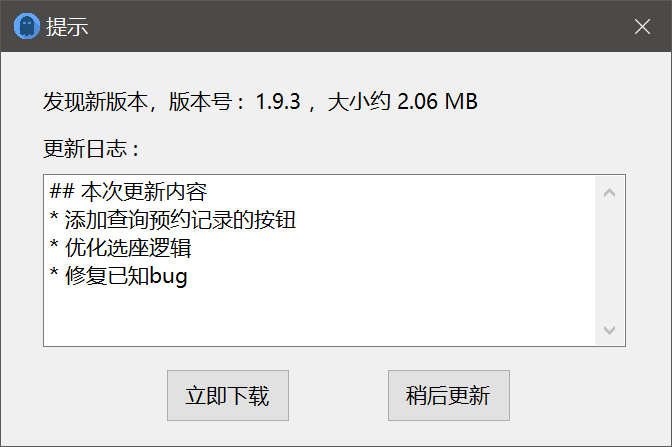

# SeatKiller-GUI

用 C# 重写的 [SeatKiller](https://github.com/yeliudev/SeatKiller) GUI 版本，新增了座位改签和座位锁定等功能，[点击此处](https://github.com/yeliudev/SeatKiller-GUI/releases) 下载编译好的最新版本的软件

本工具仅供学习交流，因使用本工具而造成的一切不良后果由使用者自行承担，与作者无关

## 功能列表

* 获取用户的信息，包括姓名、上次网页登录时间、当前状态（未入馆、已进入某分馆）和累计违约次数
* 每次启动时自动检查更新
* 晚上 22:45 定时抢次日座位（可自行选择是否指定区域、座位号）
* 检测是否已有有效预约，区分状态（预约、履约中、暂离），并可取消或释放座位
* 显示和指定座位类别，包括电源、靠窗、电脑
* 预约成功后发送邮件提醒
* 捡漏模式可用于抢当天座位
* 改签模式可用于在已有有效预约的情况下，更换座位或改签预约时间（如果空闲）
* 座位处于预约或暂离状态时，在预约信息即将失效前自动释放座位并重新预约，防止座位丢失
* 循环抢座功能可用于每天自动抢上次预约的座位
* 采用 256 位 AES 算法加密学号和密码并写入注册表，提高登录效率（此处涉及到注册表操作，系统或杀毒软件可能会报毒，可以放心允许操作）

## 软件截图

  

  

  

  

  

  

